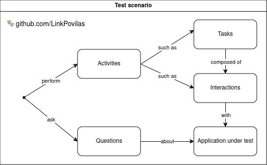

# End-to-End test design POC

🎭 Playwright project example, heavily inspired by the Screenplay design pattern.

## Project structure

```Shell
.
├── activities # Steps of a business workflow in your domain
├── data       # Test data
├── decorators # TypeScript decorators
├── fixtures   # Dependency injection and state handling
├── pages      # Lean page objects
├── questions  # Methods to retrieve information about the application under test
└── tests      # Test cases
```

## Building blocks of a test scenario



- **Questions** should return values.
- **Interactions** should not return values.
- **Tasks** are composed of multiple interactions and/or tasks. Should never return values.

## Tips for writting tests

1. **Create Lean Page Objects**

   Instead of creating large, monolithic page objects, describe related page elements together and keep business logic out of them. Modular components are easier to reuse and maintain.

2. **Define selectors as getter functions**

   By defining selectors as getter functions, they will not be initialized immediately. This can help handle application state changes more effectively and reduce test flakiness.

3. **Encapsulate interactions with natural language**

   Use natural language to encapsulate interactions with the application under test in command-like objects. This approach makes your code easier to understand.

4. **Use Playwright's test fixtures for dependency injection**

   Use test fixtures for dependency injection and object initialization to reduce duplication of test setup.

5. **Keep assertions on the test level**

   Assertions should be kept on the test level for better understanding of expected outcomes.

6. **Describe tests as features or components**

   Use simple and descriptive test titles that clearly state what the feature or component should allow the end-user to do.

7. **Keep the project structure flat**

   A flat project structure makes navigation easier. Consider using a tool like [this site](https://tree.nathanfriend.io/) to plan your project structure.

8. **Avoid third-party libraries**

   Be mindful of the number of libraries you introduce to your project. Not every problem requires a new dependency. A good rule of thumb is to avoid introducing third-party libraries unless absolutely necessary, as they can introduce additional maintenance and compatibility issues.

## Setup

```Shell
# Install dependencies.
npm i

# Install Playwright browsers.
npx playwright install

# Install Playwright operating system dependencies.
sudo npx playwright install-deps
```

## Running tests

```Shell
# Run the end-to-end tests.
npx playwright test

# Start the interactive UI mode.
npx playwright test --ui

# Run the tests in debug mode.
npx playwright test --debug
```

## References

- [Lean Page Objects](https://johnfergusonsmart.com/page-objects-that-suck-less-tips-for-writing-more-maintainable-page-objects/)
- [Using Getters](https://webdriver.io/docs/pageobjects/#get--ing-your-selectors)
- [Screenplay Pattern](https://serenity-js.org/handbook/design/screenplay-pattern/)
- [Playwright Test Fixtures](https://playwright.dev/docs/test-fixtures)
